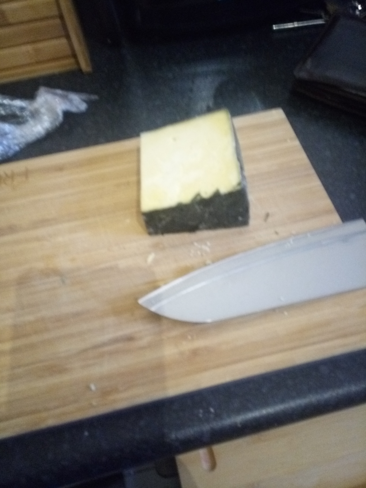
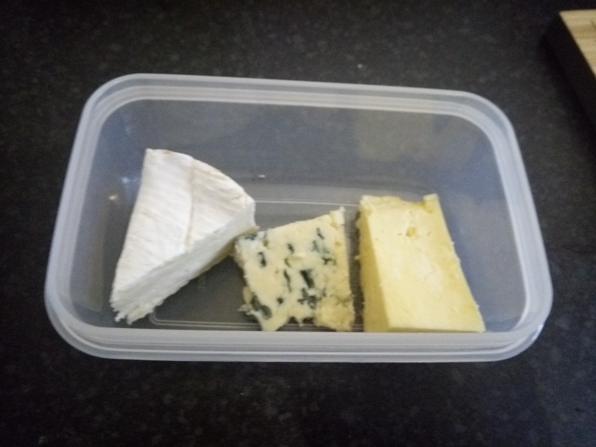

[Tupperware tubs]:Parts/Tupperware.md
[Cornish Yarg]:missing
[Camembert]:missing
[bleu d'Auvergne]:missing
[sharp kife]:missing

# Make a cheese board

Clearly no lunch is completely snazzy without a cheese board. A cheese board is something you curate from the local selection available but this is an example which I think works well

## For this step you will need:

### Tools

* 1 x  [sharp kife]
### Ingredients

* A hefty chunk [Cornish Yarg]
* A wedge [Camembert]
* A slice [bleu d'Auvergne]
### Containers

* 1 x  [Tupperware tubs]

## Method:

A simple cheeseboard should generally contain at lease one soft cheese, one hard cheese, and a blue cheese. I suggest putting a hefty chunk of [Cornish Yarg], a medium sized wedge of [Camembert], and a reasonable slice of [bleu d'Auvergne]. Generally I cut the rind off the bleu d'Auvergne and Yarg with a [sharp kife], before placing in a [Tupperware tub][Tupperware tubs].

 
 