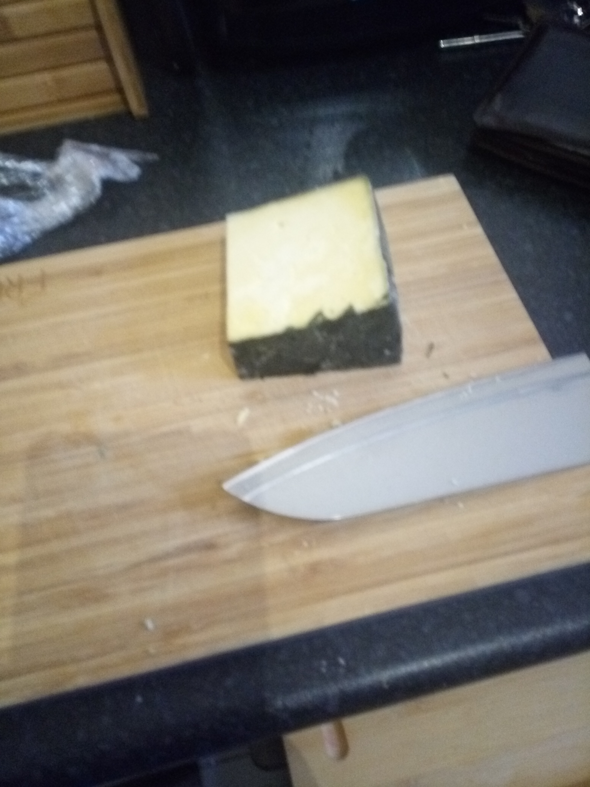
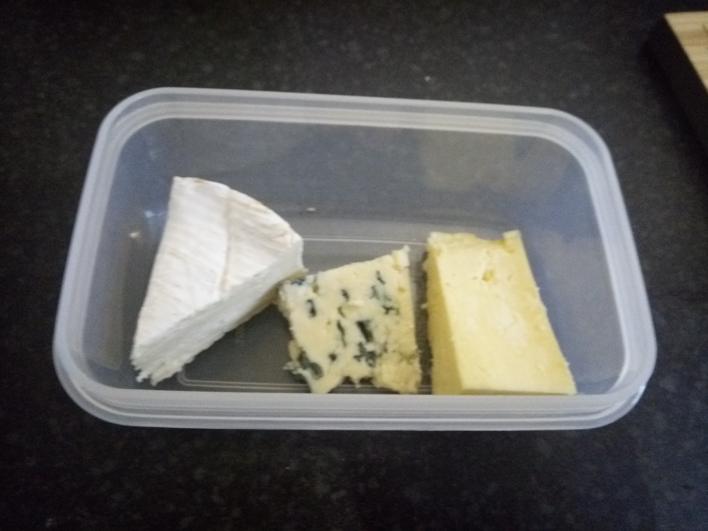

[sharp knife]:models/knife.stl "{cat:Tool,totalQty: 1}"
[Tupperware tubs]:Parts.yaml#Tupperware "{cat:Container,totalQty: 1}"

# Make a cheese board

Clearly no lunch is completely snazzy without a cheese board. A cheese board is something you curate from the local selection available but this is an example which I think works well

{{BOM}}

## Method:

A simple cheeseboard should generally contain at lease one soft cheese, one hard cheese, and a blue cheese. I suggest putting a hefty chunk of [Cornish Yarg](yarg.md){Qty: 1 hefty chunk}, a medium sized wedge of [Camembert]{Qty: 1 wedge}, and a reasonable slice of [bleu d'Auvergne]{Qty: 1 slice}. Generally I cut the rind off the bleu d'Auvergne and Yarg with a [sharp knife]{Qty: 1}, before placing in a [Tupperware tub][Tupperware tubs]{Qty: 1}.

 

